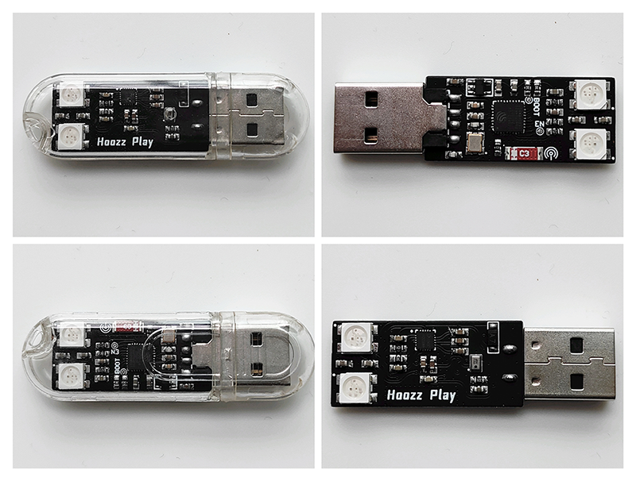

# ESP32-C3 Voice LED
A low-cost LED that has both network control and voice control.

This is a sub-repository, and the main repository is located at [Hoozz Play](https://github.com/huxiangjs/hoozz_play)

## Product View


## Basic environment
MCU:
```
idf.py --version
ESP-IDF v5.2.1-76-gbf17be96b4-dirty
```
Circuit:
```
Altium Designer 18.1.9
```

## Default voice keywords
```c
static const char* tflite_category_labels[tflite_category_count] = {
  "silence",
  "unknown",
  "开灯",
  "关灯",
  "换颜色",
  "网络配置",
};
```

## Pull source code
```shell
git clone https://github.com/huxiangjs/hoozz_play_esp32c3_voice_led.git
cd hoozz_play_esp32c3_voice_led
git submodule update --init --recursive
```

## Compile and burn from source code
```shell
cd MCU/
idf.py build && idf.py flash
```

## You can also directly burn the released bin file

1. Download the latest release zip package from the Releases column
2. Unzip the zip and you will see the following files:
   ```
   $ tree
   .
   |-- bootloader
   |   `-- bootloader.bin
   |-- flash_args
   |-- partition_table
   |   `-- partition-table.bin
   `-- voice_led.bin

   2 directories, 4 files
   ```
3. Open the latest official download tool `flash_download_tool` (official download address: [other-tools](https://www.espressif.com/en/support/download/other-tools))
4. Use the following options: (1) `Chip Type [ESP32-C3]`; (2) `WorkMode [Develop]`; (3) `LoadMode [USB]`;
5. According to the content of the `flash_args` file, configure the burning file, address and flash type. Keep the default selection for places not mentioned, and finally click **Start** to burn
